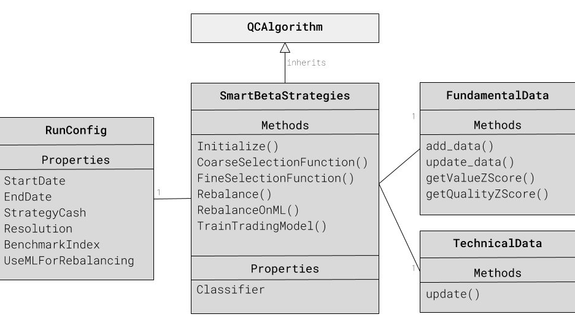
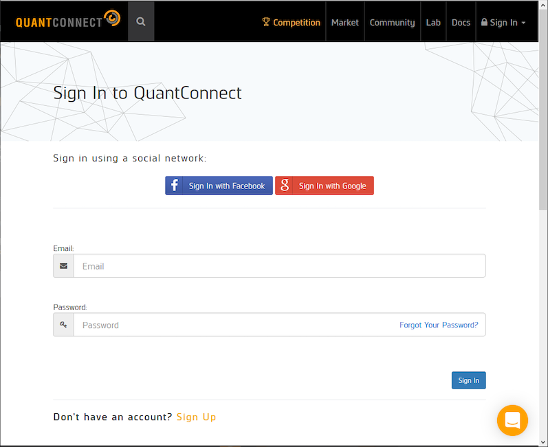
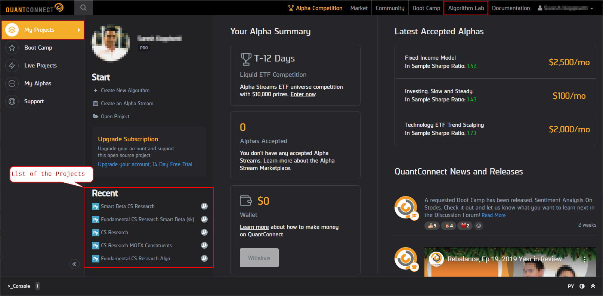
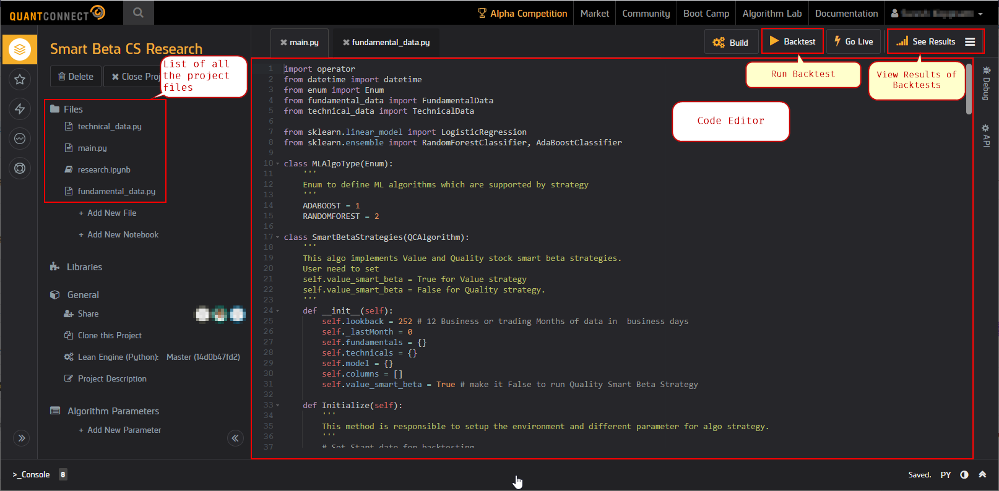
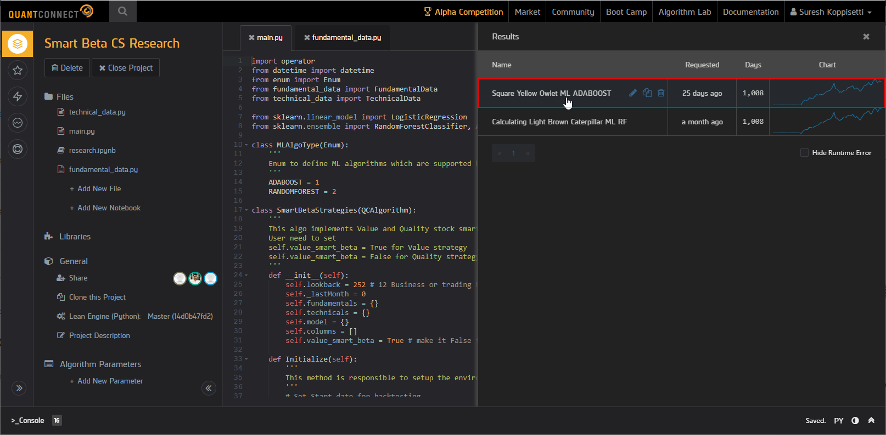
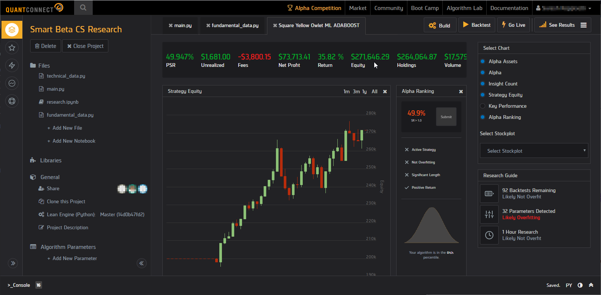

# Table of contents
- [Introduction](#introduction)
  * [Code Organization](#code_organization)
- [Implementation](#implementation)
  * [Smart Beta Strategy](#smart-beta-strategy)
  * [Tick Data Strategy](#tick-data-strategy)
    + [Data Download](#data-download)
    + [Data Preprocess](#data-preprocess)
- [QuantConnect Primer](#quantconnect-primer)

# Introduction
This repo contains the implementation of the WorldQuant University's Capstone project submitted by:
1. Mikhail Shishlenin
2. Ganesh Harke and
3. Suresh Koppisetti

## Code Organization
This project is accomplished by extending the QuantConnect's framework to implement a smart beta algorithm. The source code can be found under the <code>src</code> folder. Below is the structure of the code organization:

<pre>
src
|__ smart_beta_strategies
|   |__ run_config.py
|   |__ main.py
|   |__ fundamental_data.py
|   |__ algo_type.py
|__ tick_data_strategies
    |__ QCTickDataStrategy.py
    |__ 1_get_tick_data.py
    |__ 2_preprocess_ticks.py
    |__ 3_create_adj_ticks.py
    |__ 4_dollar_bars_triple_barrier_indicators.py
    |__ requirements.txt
    |__ data
        |__ 1_RawTicks
        |   |__ GAZP
        |       |__ GAZP_090103_090111.csv
        |__ 2_MOEX
        |   |__ RI.IMOEX_090101_191213.csv
        |__ 3_Dividends
        |   |__ GAZP.ME.csv
        |__ 4_DollarBars
        |   |__ GAZP_10_dollar_bars.csv
        |__ 5_Indicators
            |__ GAZP_10_0.1_indicators.csv
</pre>

As mentioned above, as part of the research for our project, we have used the QuantConnect platform. QuantConnect provides its framework to write our own algorithms either on the cloud at https://www.quantconnect.com/terminal/ or by downloading and using the QuantConnect's Lean engine locally. In either case, the implementation remains pretty much the same. We performed most of our analysis on the cloud because of the availablity of large US equity datasets. We have also used the local Lean engine to test the custom dollar bars we generated usign the tick data we obtained for some stocks on Russian stock exchange.

# Implementation
## Smart Beta Strategy
As part of our research we have implemented a Smart Beta alogorithm which leverages the QuantConnects framework. Below is the class diagram if of the implementation:



This particular strategy is implemented on QuantConnect's **AlgorithmLab** environment. The starting point for any algorithm developed on the QuantConnect's framework is a class which implements the **```QCAlgorithm```** base class. The **```QCAlgorithm```** provides various lifecycle hook methods which can be overridden to perform specific tasks like asset selection, trade actions, rebalacing etc.,

As shown in the class diagram above, SmartBetaStrategies in main.py is the startuo class whose Initialize method is called by the QuantConnect framework upon starting the backtesting.

## Tick Data Strategy

To proceed one needs to download and to preprocess data for feeding algorithm. Below is the file / data structure and intstructions how to run scripts.

To create python environment one needs to use conda and use 'requirements.txt'. This environment should be built on python verios 3.6.

``` bash
> conda create --name QC python=3.6.6
> conda activate QC
> pip install -r requirements.txt
```

It will be used for running python scripts as well as for LEAN Engine.

### Data Download

This script was tested on Ubuntu 18.04 and MacOs (Mojave, Catalina) with FireFox browser.

To download the data one required to have selenium webdrive installed. Instructions for that could be found [here](https://selenium-python.readthedocs.io/installation.html#drivers)

Among blue chips and MOEX index constituents the following assets were chosen for the analysis:
'AFKS', 'ALRS', 'CHMF', 'GAZP', 'GMKN', 'LKOH', 'MGNT', 'MTSS', 'NVTK', 'ROSN', 'RTKM', 'SBER', 'SNGS', 'TATN', 'VRBR', 'YNDX'

To start downloading process one needs to run '1_get_tick_data.py' from command line with the arguments 'symbol', start date and end date 'YYYY-MM-DD', i.e.:

`python.py 1_get_tick_data.py GAZP 2009-01-01 2019-12-13`


After the algorithm opens the firefox window, the frequency of the data ('ticks') and the output format ('.csv') need to be selected manually. In addition, one needs to select 'save to file' and select a checkbox 'repeat for the next occurencies'. All this need to be done onces.

Algorithm will dowload chunks of data in .csv files withing size limit of around 41.6Mb into folders named by symbol into '1_RawTicks' folder.

This web-site _does not_ provide data to download every day from 7:00am to 3:00pm GMT.

Alternatavly, raw tick data for this research can be reached in [Box folder](https://app.box.com/s/fwau5uwsrvn4lgwfwpvkf9zwnxo24k82)


### Data Preprocess

These scripts preprocess raw tick data to create dollarbars and indicators (features) for feedin ML algorithm.

1. Run 2_preprocess_ticks.py to save data within single parquet file in the folder '2_Ticks' for each company.

2. Adjust tick data backward to dividends paid - see [formula](https://help.yahoo.com/kb/SLN28256.html). Dividends data is manually downloaded from 'finance.yahoo.com' and saved to the folder '3_Dividends'. Run 3_create_adj_ticks.py for adjusting and saving data into the folder '3_AdjTicks'.

3. The last preprocessing script 4_dollar_bars_triple_barrier_indicators.py creates dollarbars and save them into folder '4_DollarBars', then creates dataseries to feed trading altorithm and saves them into folder '5_Indicators'. The dollarbars and indicators are built based on input parameters, that could be changed for modelling variations.


### Running Algos

Trading algorithm is developed to run within open source QuantConnect platform. Trading algorithm could be executed on the web [QuantConnect](https://www.quantconnect.com) service or locally on the underlying [LEAN Engine](https://github.com/QuantConnect/Lean/tree/master/Algorithm.Python#quantconnect-python-algorithm-project).

- To run it with QuantConnect platform one needs to login, 'Create new Algorithm' within 'Algorithm Lab' (or 'Lab'), and substitute the code by the code from 'QCTickDataStrategy.py'. This script contains links to dropbox folders with already created 'Indicators' files, which can be substituted by the files you created at the 'Data Preprocess' step above. After starting 'Backtest', QuantConnect will generate statistics and reports. (This scripts were tested under PRO account and could be running slowly under free account).

- To run algorithm locally, one needs to have Visual Studio and python envrionment, which was created at the first step. Details on istallation, compiling and running algotithm are available [here](https://medium.com/hackernoon/setting-up-your-own-algorithmic-trading-server-4bbdf0766c17). In this step the dropbox links to files with indidators can be substituted to local file links.


# QuantConnect Primer
Following is a quick primer on how to use QuantConnect. To run the **Smart Beta Fundamental** strategies, the user need to follow the steps shown below:
1. **Login:** Open Web browser and go to https://www.quantconnect.com/login?target=Web. You will see QuantConnect login page. Please enter _User Name_ and _Password_ that are provided to you.
Fig: QuantConnect Login


2. **Explore AlgorithmLab:** You will then be taken to the **AlgorithmLab** dashboard as shown in the screenshot below. On this screen notice the outlined sections. All the projects that are shared with you will be visible which you can click to check the source code for the algorithms.
Fig: AlgorithmLab Dashboard


3. **Explore and Edit a Project:** Clicking on the any of the projects opens the Project explorer along with the code Editor as shown in the screenshot below.
Fig: Project Explorer and Editor


4. **Run Backtesting:** To run the backtesting, ...

5. **Explore the Results:** To explore the results, ...
<br>Fig: Backtest Results Dashboard

Fig: Backtest Results


